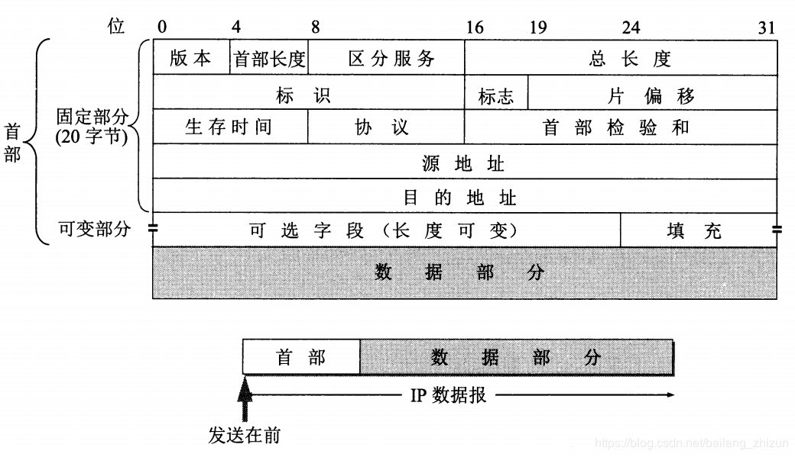
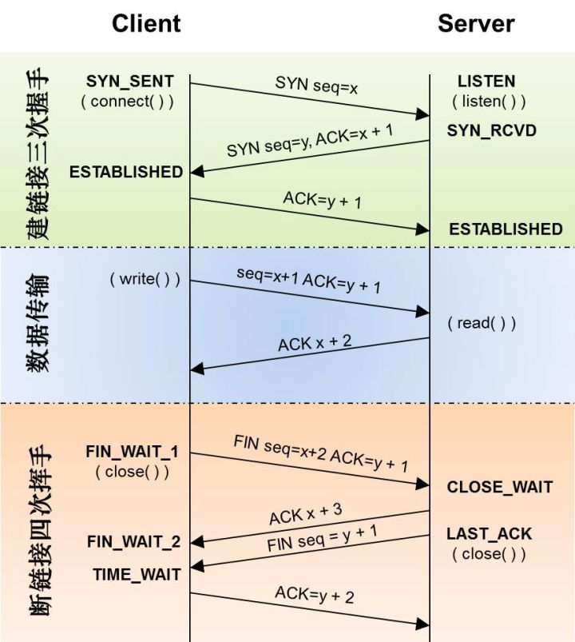
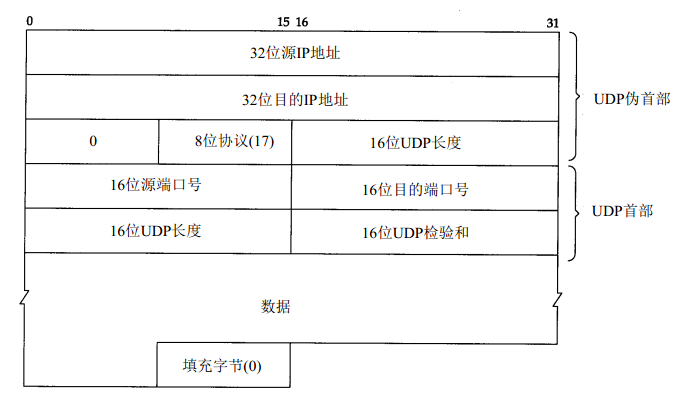

## 子网掩码及CIDR(无类-域间-路由 classless inner-domen route)

​	通俗地讲,CIDR就是用于局域网的协议，用来标记网络号和主机号。
"无类(classless)"的含义，我理解的是：通常IP地址被分为A、B、C、D类，但是局域网用这个方式去分类会比较繁琐，也不灵活，所以就用了另外一个无类的协议，也就是不属于ABCD的任何一种协议。


> 已知16.158.165.91/22，这个CIDR,求网络中的第一个地址、子网掩码和广播地址

​	16.158的部分不会动，它占了前16位。中间的165，变为二进制为10100101。除了前面的16位，还剩6位。所以，这8位中前6位是网络号，16.158.<101001>，而<01>.91是机器号；所以第一个地址是16.158.<101001><00>.1,即16.158.164.1，子网掩码是255.255.<111111><00>.0,即255.255.252.0，广播地址是16.158.<101001><11>.255,即16.158.167.255.


## IP层报文结构



- 版本（4 bit）：一般都是ip-v4，值为0100。如果是ip-v6，值为0110
- 首部长度（4bit）： 4bit最大值为15。单位是行。IP首部默认是20字节，也就是5行。
- 服务类型（8bit）：区分服务时,这个字段才起作用,在一般的情况下都不使用这个字段。
- 总长度（16bit）：**IP报文总长**,包含首部和数据（TCP/UDP+data）。最小是20个字节。
- 标志（16bit）：唯一值,标识一个报文的所有分包。因为分片不一定按序到达，所以在重组时需要知道分片所属的报文。每产生一个数据报，计数器加1，并赋值给此字段。
- 其他的暂时不作介绍，后期有需要再来补充


## TCP报文结构


***源端口：***发送端所使用的端口，这里有8bit存储空间，所以理论上端口的范围是0~2^8(65535)

***目的端口：***接收方使用的端口

***序号：***seq。表明当前发送到第几个数据了。假如是第一次发送，也就是SYN阶段，这就是一个随机数；否则，该序号就是上次发送的序号+1。后续的作用就是数据块的同步

***确认号：***ack。表明本端已经接收到的数据，实际上告诉对方，在这个序号减1以前的字节已正确接收。若该数据包是整个TCP连接中的第一个包(SYN包)，则确认号一般为0，换句话说，就是还未接收数据。**只有ACK标志位为1时，确认序号字段才有效**

***数据偏移：***TCP首部一般情况下是20个字节（在没有可变内容的情况下），每4个字节（32bit）为固定的一行，那真正的数据应该在第6行出现，因为前面5行都是首部。所以数据偏移的值默认是5

***标志位：***这里有多个标识位，都有各自的用途，常用的是SYN和ACK，这里不赘述了。需要注意的是：不要将确认序号Ack与标志位中的ACK搞混了。

ACK确认标志用于`确认数据包的成功接收，也用于握手和挥手的确认`

***窗口大小：***略

***校验和：***略

***紧急指针：***略

***选项（可变）：***用于支持一些特殊的变量，比如最大分组长度(MSS)。TCP协议会根据这个字段进行拆包

***填充：***用户保证可变选项为32bit的整数倍，也就是保证一行。我猜测可能是内存对齐的原因吧，这样会提高传输的效率。


## TCP工作流程



#### 三次握手流程简析（配合上面的报文结构指示图会更容易理解）

1. 客户端SYN标记为1，seq序号=0（这里的0不是真正意义上的0，是相对位置），然后将包发给服务端，并进入SYN_SEND状态
2. 服务端将SYN标记为1，seq序号=0。ACK标记为1，确认号为0+1=1。将包发送给客户端，进入SYN_RECV状态
3. 客户端将ACK标记为1，将确认号标记为1。将包发送给服务端，并进入ESTABLISH状态。
4. 服务端收到确认包，也进入ESTABLISH状态。
5. ***此时双方开始发送数据，其实在3阶段，客户端就可以和请求数据一并发送到服务端***

> 我理解的是，发SYN就代表写数据，seq：我发到哪个数据了；发ACK就代表读数据，ack：我读到哪个数据了。有篇文章分析得非常好，地址是：https://zhuanlan.zhihu.com/p/53338327
>
> 
>
> 
>
> 三次握手白话文翻译：
>
> 1.客户端发送SYN，seq=0，告诉服务端，我要开始建立连接了，但是我需要先同步一下seq号，你需要把seq+1返回给我，我判断，如果有误，我就拒绝连接
>
> 2.服务端收到之后，发送SYN/ACK seq=0，ack=0+1(这里的1代表相对位置)。意思是，我这边收到请求了，我会将你发过来的序号在ack返回给你，但是我这边也要收到你的确认，否则我也不连接。我给你发个seq，你那边回复我下。回复校验我就连接你。
>
> 3.收到ack了，并且合法，我再给你发一个确认的ack，不然你不跟我连接。于是又发了ACK标记。ack=1
>
>  **此时三次握手建立成功，下面开始传输数据**
>
>  客户端发送http请求"GET / HTTP1.1 acb"  此时seq是1，ack也是1
>
> 服务器如果收到请求，就要回ACK，ack = 1+接收到内容长度，seq=1
>
> 客户端收到服务端的ACK之后，会将seq=服务器的ack，ack = 1，然后就停了
>
> 这样的话既可以保证顺序正确，也不丢包

***


###  四次挥手这里就不赘述了，有空再补充，道理其实都是一样的。

其核心原理和三次握手差不多，略。。。


## UDP报文结构

比较简单，这里文字叙述

UDP首部由4各字段组成，各占两个字节：

（1）源端口：

在需要对方回信时使用，不需要时全为0。

（2）目的端口：

发送UDP数据报的目的地。

（3）长度：

UDP数据报的长度，最短为8个字节，只包含首部。

（4）检验和

用于检验UDP数据报在传输过程中有没有出差错，有则丢弃。


就很简单，直接发送出去就完事了！！！	


## 大概表述一下整个TCP/IP的流程

> **IP{iphdr+TCP{tcphdr+data}}**
>
> **IP{iphdr+UDP{udphdr+data}}**

**发送数据**

1. 客户端在应用层（HTTP/FTP）生成数据，传到TCP层
2. TCP层将数据包装一下，并在数据包外堆叠TCP报首（端口信息）
3. IP层堆叠报首（ip地址）
4. 数据链路层堆叠报首（MAC地址）

**接收数据**

1. 数据链路层拿到数据包，判断mac地址是否匹配，不匹配就丢包
2. IP层判断ip地址是否匹配
3. TCP层判断端口是否匹配，然后将数据分发到指定的应用。还可能会存在端口转发的情况
4. http层进行数据解析和处理


## UDP伪头部



伪头部结构：其中有IP源地址，IP目的地址，协议号(TCP:6/UDP:17)及TCP或UDP数据报的总长度(头部+数据)。

```c
struct pseudo_header_udp {
    unsigned int source_address;
    unsigned int dest_address;
    unsigned char placeholder;
    unsigned char protocol;
    unsigned short udp_length;

    struct udphdr udp;
};
```


## 校验和算法

1. 将校验和字段置为0,然后将IP包头按16比特分成多个单元，如包头长度不是16比特的倍数，则用0比特填充到16比特的倍数；
2. 对各个单元采用反码加法运算(即高位溢出位会加到低位,通常的补码运算是直接丢掉溢出的高位),将得到的和的反码填入校验和字段；
3. 发送数据包。