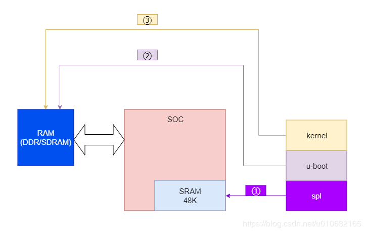

## 嵌入式设备开机启动流程

`SoC`是system-on-chip，也就是我们口头上说的cpu。

SRAM是芯片上的静态ram，内存一般都比较小。开机之后外部ram都无法使用，所以只能用这个。

`SPL(secondary program loader)`是一个十分小的bin文件，它是用来引导主u-boot文件。对于一些`SRAM`很小的`SOC`，无法一次性加载`ROM`中的`bootloader`到`SRAM`中，因为一般`SRAM`远远小于`bootloader`的大小。这时候`SPL`应运而生了。SPL（Secondary programloader）是uboot第一阶段执行的代码。主要负责搬移uboot第二阶段的代码到系统内存（System Ram，也叫片外内存）中运行。SPL是由固化在芯片内部的ROM引导的。我们知道很多芯片厂商固化的ROM支持从nandflash、SDCARD等外部介质启动。所谓启动，就是从这些外部介质中搬移一段固定大小（4K/8K/16K等）的代码到内部RAM中运行。这里搬移的就是SPL。在最新版本的uboot中，可以看到SPL也支持nandflash，SDCARD等多种启动方式。当SPL本身被搬移到内部RAM中运行时，它会从nandflash、SDCARD等外部介质中搬移uboot第二阶段的代码到系统内存中。

所以基本上，引导装载程序只是做你想要做的——将数据从闪存复制到操作内存中。这真的很简单。

1. 图中①是 SPL在u-boot第一阶段的装载程序，初始化最基本的硬件，比如关闭中断，内存初始化，设置堆栈等最基本的操作，设置重定位；
2. 图中②是会装载主u-boot程序，然后初始化其他板级硬件，比如网卡，nand flash等待，设置u-boot本身的命令和环境变量；
3. 图中③是加载kernel到RAM，然后启动内核；

## Android手机开机启动流程

上电后：boot rom激活，cpu将从预定义地方开始执行，并将bootloader第一阶段的代码加载到片内ram。

第一阶段的bootloader载入到片内ram后，运行的目的是检测片外ram（外部设备），然后找到bootloader2并将第二段bootloader加载到片外ram。

bootloader第二阶段加载到片外ram后，cpu开始执行。主要的作用是设置内核启动所需的条件（网路，内存等），然后将内核镜像img从外部存储设备加载到物理内存。这里就是Android厂商加锁的地方

接下来BootLoade就将控制权交给了Kernel，内核开始执行start kernel.

。。。

## Linux PC开机启动流程

​	固化在主板上的BIOS将运行，目的是检查系统的硬件状态，然后将各个硬件初始化到合适的状态以运行操作系统。紧接着运行MBR中的代码，将Linux内核载入到ram，然后将控制权交给了Kernel

**一、硬件上电**

**二、一级启动：bootROM**

Boot ROM是厂商都无法进行更改，固化在芯片内部的ROM；

作用:

确定用于启动的设备；

从启动的设备的位置搬移一小段代码（4k/8k/16k）到RAM中运行，即SPL；

**三、二级启动：SPL+uboot**

1.SPL: Secondary Program Loader：

作用:

初始化DDR；

从启动的设备搬移第二段代码到RAM中，加载uboot；

（有些SoC是将bootloader复制到RAM后，再进行DDR初始化；）

2.uboot: Universal boot loader：

U-Boot从启动设备上面读取、分析环境变量获得kernel和rootfs存储位置，以及所需的kernel command line；

自动检测系统RAM和eMMC/Nand Flash容量和参数；

设置以太网口MAC地址，并配置好硬件准备加载Linux kernel；

加载Linux kernel到RAM，至此系统控制权则转移到kernel来处理；

**四、Linux Kernel**

系统Kernel初始化Linux，加载rootfs，最后启动’init’来初始化Linux user space

**五、不同的OS**

Android、Yocto、ubuntu、fedora

补充:

一个嵌入式Linux系统从软件的角度看通常可以分为四个层次：

1、 引导加载程序。包括固化在固件(firmware)中的boot代码(可选)，和BootLoader两大部分。（bootROM，uboot）

2、Linux内核。特定于嵌入式板子的定制内核以及内核的启动参数。（linux kernel）

3、 文件系统。包括根文件系统和建立于Flash内存设备之上文件系统。通常用ramdisk来作为rootfs。

4、 用户应用程序。特定于用户的应用程序。有时在用户应用程序和内核层之间可能还会包括一个嵌入式图形用户界面。常用的嵌入式GUI有：MicroWindows和MiniGUI等。

BootLoader是一段小程序，主要功能是引导操作系统启动。可以把它想象成PC机Linux上的GRUB/LILO引导程序，只不过在嵌入式linux中，没有BIOS，而是直接从flash中运行，来装载内核。它可以初始化硬件设备，从而将系统的软硬件环境带到一个合适的状态，以便为最终调用操作系统做好准备。