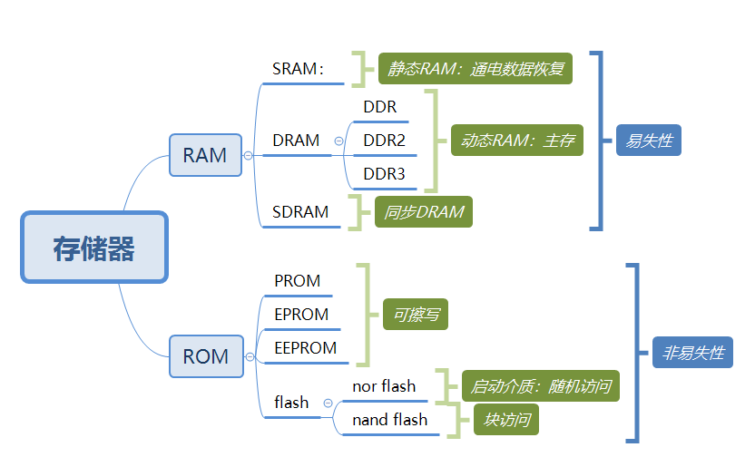
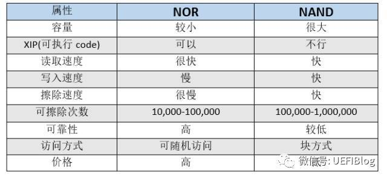

## SRAM（静态RAM）

​	内部由晶体管组成，打开表示1，关闭表示0，且状态会保持，不需要刷新。

## DRAM（动态RAM）

​	DRAM的数据实际上是存在电容里的。而电容放久了，内部的电荷就会越来越少，对外就形成不了电位的变化。而且当对DRAM进行读操作的时候需要将电容与外界形成回路，通过检查是否有电荷流进或流出来判断该bit是1还是0。所以无论怎样，在读操作中我们都破坏了原来的数据。所以在读操作结束后需要将数据写回DRAM中。在整个读或者写操作的周期中，计算机都会进行DRAM的刷新，通常是刷新的周期是4ms-64ms。

## nor flash 和 nand flash

其实就是告诉你，nor flash可以像普通ROM一样执行程序。这点让它成为BIOS等开机就要执行的代码的绝佳载体。nand flash不可以直接运行代码。nand flash需要将代码以“块”的形式复制到sram然后去运行。**固态硬盘使用nand做的**

## PROM([可编程只读存储器](https://www.baidu.com/s?wd=可编程只读存储器&tn=SE_PcZhidaonwhc_ngpagmjz&rsv_dl=gh_pc_zhidao))

这种存储器用作永久存放程序之用，烧写在上面的程序代码可以直接被cpu执行，不需要加载到ram。常用于电子游戏机、电子词典等预存固定数据或程序的各式电子产品之上。[PROM](https://www.baidu.com/s?wd=PROM&tn=SE_PcZhidaonwhc_ngpagmjz&rsv_dl=gh_pc_zhidao)与狭义的ROM（Mask ROM）的差别在于前者可在IC制造完成后才依需要写入数据，后者的数据需在制造IC时一并制作在里面。

​	