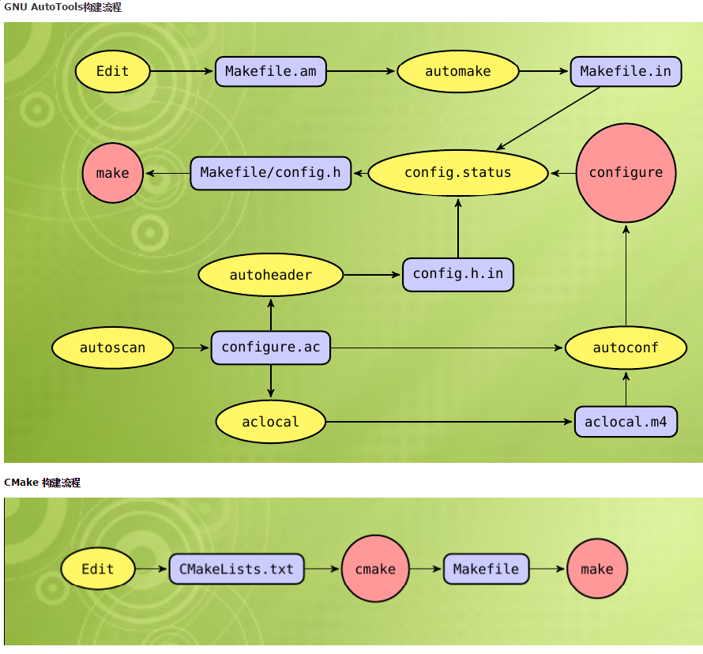

## C语言的指针（核心要点）

​	之前指针老是学不好，因为什么呢❓❓❓

​	因为写法问题！！！之前书上的写法都是 `int *p`形式(星号*是和参数p挨在一起)，再次强调下，这个写法很容易误导人。建议以后的教科书上不要这么写。好学生都被教坏了。

​	**写成`int* p`形式(星号*是和参数类型int挨在一起)会更好理解，指针就没那么难了。**

```c
int a = 123; //变量a就是普通的整形
int* p = &a; //变量p是一个int的指针类型，指针类型只能用来存储地址，所以将变量a的地址保存到变量p中。
printf("%d\n",*p); //打印123，同等于printf("%d",a);
printf("%p\n",p); //打印变量a的内存地址，同等于printf("%p",&a);
```


## C语言中的`*_t`结尾是什么类型的数据

​	比如`uint8_t`、`uint16_t`、`uint32_t`、`uint64_t`......这些都是整形变量的别名，这么做是为了规范和可移植性。用`_t`结尾可以理解成是通过typedef来定义的。**其实通过利用这样的别名，程序还是很好理解的👍👍👍**

`size_t`：sizeof的typedef形式


## CMakeLists.txt文件配置说明

这个文件的目的是生成makefile，然后通过make命令可以编译链接成可执行文件。



```cmake
#cmake版本号
cmake_minimum_required(VERSION 3.13)
#项目名称，后续可以通过${PEOJECT_NAME}获取到,最好设置成项目文件夹的名字。如果不设置的话，默认就是项目文件夹的名字
project(test_d)
#设置变量
set(CMAKE_C_STANDARD 11)
#生成可执行文件,参数格式(可执行文件的名字 入口文件(这里应该是一个包含main函数的c文件))
add_executable(abc main.c)#可执行文件名字叫abc，入口文件是main.c
add_executable(def test_p.c)
```


## 创建多线程

```c
pthread_t tid;
//第一个参数tid，第二个参数线程param，一般传NULL，第三个参数，方法指针，第四个参数，方法的参数列表，如果没有参数就传NULL
pthread_create(&tid, NULL, (void *) add, NULL);
pthread_join(tid,NULL);
```


## 如何创建RAW SOCKET

```c
//
// Created by wu on 2019-12-09.
//
#include <stdio.h>
#include <netinet/ip.h>//Provides declarations for ip header
#include <netinet/tcp.h>//Provides declarations for tcp header
#include <arpa/inet.h>
#include <stdlib.h> //for exit(0);
#include <string.h> //memset,memcpy

//needed for checksum calculation
struct pseudo_header_tcp {
    unsigned int source_address;
    unsigned int dest_address;
    unsigned char placeholder;
    unsigned char protocol;
    unsigned short tcp_length;

    struct tcphdr tcp;
};

//checksum is 16bit,should use unsigned short
static unsigned short calculate_checkcsum(unsigned short *ptr, int pktlen) {
    register uint32_t csum = 0;

    //add 2 bytes / 16 bits at a time!!
    while (pktlen > 1) {
        csum += *ptr++;
        pktlen -= 2;
    }

    //add the last byte if present
    if (pktlen == 1) {
        csum += *(uint8_t *) ptr;
    }

    //add the carries
    csum = (csum >> 16) + (csum & 0xffff);
    csum = csum + (csum >> 16);

    //return the one's compliment of calculated sum
    return ((short) ~csum);
}

unsigned short src_port = 0;
unsigned int src_inet_addr = 0;
unsigned short dst_port = 0;
unsigned int dst_inet_addr = 0;

int main(int argc, char *argv[]) {
    if (argc < 5) {
        printf("usage:./<script name> <src ip> <src port> <dst ip> <dst port>\n");
        exit(1);
    }

    int i;
    for (i = 1; i < argc; i++) {
        if (i == 1) {
            printf("src_ip = %s\n", argv[i]);
            src_inet_addr = inet_addr(argv[i]);
            continue;
        }
        if (i == 2) {
            src_port = (unsigned short) atoi(argv[i]);
            printf("src_port = %d\n", src_port);
            continue;
        }
        if (i == 3) {
            printf("dst_ip = %s\n", argv[i]);
            dst_inet_addr = inet_addr(argv[i]);
            continue;
        }
        if (i == 4) {
            dst_port = (unsigned short) atoi(argv[i]);
            printf("dst_port = %d\n", dst_port);
            continue;
        }
    }

    // tcp-datagram packet.size is size of iphdr + size of tcphdr
    char datagram[sizeof(struct iphdr) + sizeof(struct tcphdr)];
    bzero(datagram, sizeof(datagram));

    // 将 ip 首部指针和 tcp 首部指针指向各自的位置，
    struct iphdr *ip_header = (struct iphdr *) datagram;
    struct tcphdr *tcp_header = (struct tcphdr *) (datagram + sizeof(struct iphdr));

    // 填充 ip 首部字段
    ip_header->ihl = 5;                //普通 IP 数据报
    ip_header->version = 4;                //IPv4
    ip_header->tos = 0;
    ip_header->tot_len = sizeof(datagram);
    ip_header->id = 0;                      //自定 IP 包标识，方便筛选
    ip_header->frag_off = 0;
    ip_header->ttl = 64;
    ip_header->protocol = IPPROTO_TCP;                      //指定承载的是 TCP 数据包
    ip_header->check = 0;                                //之后需要计算校验和
    ip_header->saddr = src_inet_addr;
    ip_header->daddr = dst_inet_addr;

    //计算 ip 校验和，两个字节
    ip_header->check = calculate_checkcsum((unsigned short*) datagram, sizeof(struct iphdr));

    // 填充 tcp 首部字段
    tcp_header->source = htons(src_port);   //htons means host to network short
    tcp_header->dest = htons(dst_port);     //if spec value < 255(8bit) , there is no need to use htons
    tcp_header->seq = 0;                    //自定义 seq 序号，方便筛选
    tcp_header->ack_seq = 0;
    tcp_header->doff = 5; //tcp header size ,5行,每行4个字节（32bit）
    tcp_header->fin = 0;
    tcp_header->syn = 1;                                //构造三次握手中的第一次，SYN 置 1
    tcp_header->rst = 0;
    tcp_header->psh = 0;
    tcp_header->ack = 0;
    tcp_header->urg = 0;
    tcp_header->window = htons(65535);
    tcp_header->check = 0;                                //之后需要计算校验和
    tcp_header->urg_ptr = 0;

    //借助伪头部计算 tcp 校验和
    struct pseudo_header_tcp psh;
    psh.source_address = src_inet_addr;
    psh.dest_address = dst_inet_addr;
    psh.placeholder = 0;
    psh.protocol = IPPROTO_TCP;
    psh.tcp_length = htons(sizeof(struct tcphdr));
    memcpy(&psh.tcp, tcp_header, sizeof(struct tcphdr));

    //计算 tcp 校验和
    tcp_header->check = calculate_checkcsum((unsigned short *) &psh, sizeof(struct pseudo_header_tcp));

    //↑↑↑↑↑↑↑↑↑↑↑↑↑↑↑↑↑↑↑至此，第一次握手的 TCP/IP 数据包构造完毕↑↑↑↑↑↑↑↑↑↑↑↑


    // 创建一个使用 TCP/IP 协议并可以构造首部数据的 raw_socket
    int send_socket = -1;
    int one = 1;
    const int *val = &one;
    if ((send_socket = socket(AF_INET, SOCK_RAW, IPPROTO_IPIP)) < 0) {
        return -1;
    }
    if (setsockopt(send_socket, IPPROTO_IP, IP_HDRINCL, val, sizeof(one)) < 0) {
        return -1;
    }

    // 根据指定 ip 和端口，发送探测包
    struct sockaddr_in dest;
    memset(&dest, 0, sizeof(dest));
    dest.sin_family = AF_INET;
    dest.sin_port = htons(dst_port);
    dest.sin_addr.s_addr = dst_inet_addr;

    ssize_t bytes_sent = sendto(
            send_socket, datagram, sizeof(datagram),
            0, (struct sockaddr *) &dest, sizeof(dest)
    );

    if (bytes_sent < 0) {
        fprintf(stderr, "ERROR: Send datagram fail\n");
    } else {
        printf("%zu bytes send success !\n", bytes_sent);
    }

    // sockfd should close here !
    return 0;
}
```

编译成可执行文件：`gcc -o executable-name source-file.c`

>  **在Linux系统编译并运行上面的代码后，发现客户端会发送一个RST包给服务端，为什么？**

​	因为client发了SYN包，server发回来SYN/ACK包，你的操作系统内核先于你的程序接收到这个包，它检查内核里的socket，发现没有一个socket对应于这个包（因为raw tcp socket没有保存ip和端口等信息，所以内核不能识别这个包），所以发了一个RST包给对方，于是对方的tcp socket关闭了。

