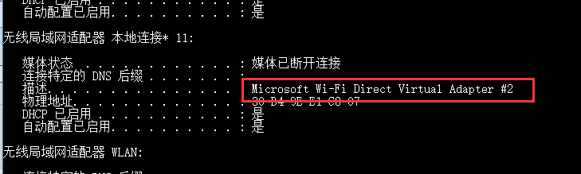

## 构造数据包

```python
a = IP()/TCP()
b = TCP()/IP()
```

上面的例子中，a和b的区别是：a构造出来的数据包，在IP层的proto字段为tcp；b的IP层proto字段为ip

>  总结：后面的会覆盖前面的属性。所以最好是最底层的写在前面

**一个标准的写法**

`Ether()/IP()/TCP()/"GET / HTTP1.1"`

输出是：

```bash
###[ Ethernet ]###
  dst= ff:ff:ff:ff:ff:ff
  src= 00:00:00:00:00:00
  type= IPv4
###[ IP ]###
     version= 4
     ihl= None
     tos= 0x0
     len= None
     id= 1
     flags=
     frag= 0
     ttl= 64
     proto= tcp
     chksum= None
     src= 127.0.0.1
     dst= 127.0.0.1
     \options\
###[ TCP ]###
        sport= ftp_data
        dport= http
        seq= 0
        ack= 0
        dataofs= None
        reserved= 0
        flags= S
        window= 8192
        chksum= None
        urgptr= 0
        options= []
###[ Raw ]###
           load= 'GET / HTTP1.1'
```


## 发送数据包

首先需要用python搭建一个tcp服务器

```python
# -*- coding: utf-8 -*-
import socket
import threading


def handle_connection(socket, addr):
    print("有客户端连接了...\n")
    while True:
        data = socket.recv(1024)
        if data:
            print(data)


def main():
    s = socket.socket(socket.AF_INET, socket.SOCK_STREAM)
    s.bind(('0.0.0.0', 9999))
    s.listen()
    print('服务器正在监听9999端口。。。\n')

    while True:
        sock, addr = s.accept()
        t = threading.Thread(target=handle_connection, args=(sock, addr))
        t.start()


main()

```

***然后要`sudo scapy`进入scapy，不然有可能会报错***

send方法有好几种

- 发送三层包：send(pkt, inter=0, loop=0, count=1, iface=N) 。意思就是说，IP层（前两层分别是物理层，数据链路层）之前的我不需要关心，只需要关注IP层及之上的层，比如HTTP，FTP层，这也是比较通用的方法。
- 发送二层包：sendp(pkt, inter=0, loop=0, count=1, iface=N)，根据上面的分析得出，我只需要关心数据链路层及之上的层。

```bash
>>> send(IP(dst="192.168.8.104")/TCP(dport=9999))
.
Sent 1 packets.
```

发送成功了，但是看不到返回过来的数据包，我要想办法看到数据包。

### 发包和收包（常用方法）

* 三层发包和收包：sr(pkt, filter=N, iface=N)`感觉简写的都是默认方法`
* 二层发包和收包：srp(pkt, filter=N, iface=N) 
* 三层发包但是仅仅接受第一个回复：sr1(pkt, inter=0, loop=0, count=1, iface=N),
* 二层发包但是仅仅接受第一个回复：srp1(pkt, filter=N, iface=N) 


上面的例子中，我们发出去了一个SYN包，这个时候尝试去接收SYN/ACK包

TCP_SYN=IP()/TCP(dport=9999, flags="S", seq=100)
TCP_SYNACK=sr1(ip/TCP_SYN)

接收到之后再发ACK包

my_ack = TCP_SYNACK.seq + 1
TCP_ACK=TCP(dport=9999, flags="A", seq=101, ack=my_ack)
send(ip/TCP_ACK)

此时链接建立成功，需要发送数据了

my_payload="space for rent!"
TCP_PUSH=TCP( dport=9999, flags="PA", seq=102, ack=my_ack)
send(ip/TCP_PUSH/my_payload)


### 以下是用scapy实现的三次握手

**Scapy 3 way handshake**

```python
Creating a 3 Way Handshake
Cooked vs. Raw sockets
 
Normally, the Linux kernel takes care of setting up and sending and receiving network traffic. It automatically sets appropriate header values and even knows how to complete a TCP 3 way handshake. Uising the kernel services in this way is using a "cooked" socket.
 
Scapy does not use these kernel services. It creates a "raw" socket. The entire TCP/IP stack of the OS is circumvented. Because of this, Scapy give us compete control over the traffic. Traffic to and from Scapy will not be filtered by iptables. Also, we will have to take care of the TCP 3 way handshake ourselves.
 
Sending a TCP SYN
 
We send on the wireshark or tcpdump capture following packets:
- SYN (outgoing)
- SYN ACK(incomming)
- RST/ACK (outgonig)
 
The RST Packet is from the Kernel, because no listen Port on the Source Port. (Scapy is not unsing RAW Socket)
 
iptables to supress the RST
 
	iptables -A OUTPUT -p tcp --tcp-flags RST RST -s {our IP} -d {dest IP} -dport {source port} -j DROP
	iptables -A OUTPUT -s {our IP} -d {dest IP} -p ICMP --icmp-type port-unreachable -j DROP
Replace {our IP} / {dest IP} and {source port} with your parameters
 
TCP 3 Way Basics
 
s_ip = IP ; s_port = port ; s_seq = seq # ; s_ack = ack #
d_ip = IP ; d_port = port ; d_seq = seq # ; d_ack = ack #
 
handshake
s_ip:s_port -> d_ip:d_port, SYN, s_seq, s_ack
d:ip:d_port -> s_ip:s_port, SYN/ACK, d_seq, d_ack=(s_seq + 1)
s_ip:s_port -> d_ip:d_port, ACK, d_seq + 1, s_ack=(d_seq + 1)
 
Sample Script
 
#!/usr/bin/python
from scapy.all import *

ip=IP(src="10.0.0.1", dst="20.0.0.2")
TCP_SYN=TCP(sport=1500, dport=80, flags="S", seq=100)
TCP_SYNACK=sr1(ip/TCP_SYN)

my_ack = TCP_SYNACK.seq + 1
TCP_ACK=TCP(sport=1500, dport=80, flags="A", seq=101, ack=my_ack)
send(ip/TCP_ACK)

my_payload="space for rent!"
TCP_PUSH=TCP(sport=1500, dport=80, flags="PA", seq=102, ack=my_ack)
send(ip/TCP_PUSH/my_payload)
```

来自网站<https://www.packetlevel.ch/html/scapy/scapy3way.html>


## 嗅探

```python
sniff(filter="",iface="any", prn=function, count=N)
```

1、filter的规则使用 Berkeley Packet Filter (BPF)语法，具体参考：<http://blog.csdn.net/qwertyupoiuytr/article/details/54670477>

2、iface用来指定要在哪个网络接口上进行抓包【即网卡的名称】（通常不指定即所有网络接口）；例如：

```python
dpkg = sniff(filter="host 192.168.191.5 and tcp",iface="Microsoft Wi-Fi Direct Virtual Adapter #2",count=2)
```

其中windows下要获取iface网卡名称可以使用： ipconfig /all  ，如下：



3、prn指定回调函数，每当一个符合filter的报文被探测到时，就会执行回调函数，通常使用lambda表达式来写回调函数

4、count指定最多嗅探多少个报文（是指符合filter条件的报文，而非所有报文）