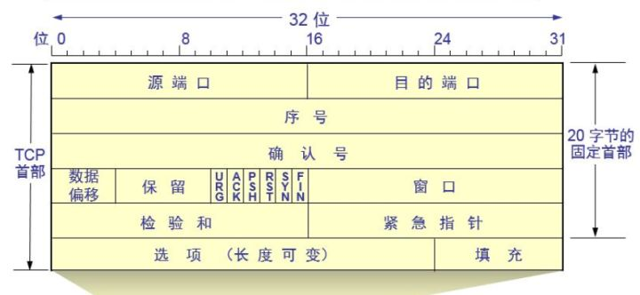
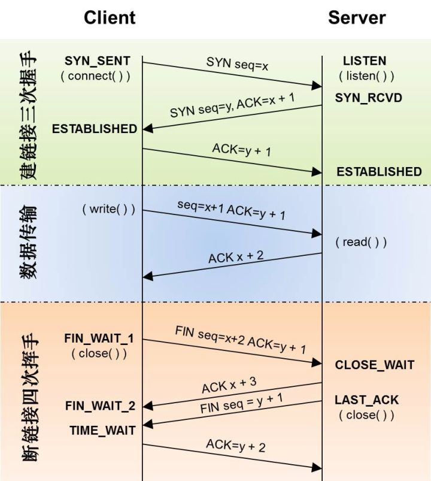

## 子网掩码及CIDR(无类-域间-路由 classless inner-domen route)

​	通俗地讲,CIDR就是用于局域网的协议，用来标记网络号和主机号。
"无类(classless)"的含义，我理解的是：通常IP地址被分为A、B、C、D类，但是局域网用这个方式去分类会比较繁琐，也不灵活，所以就用了另外一个无类的协议，也就是不属于ABCD的任何一种协议。

> 16.158.165.91/22，这个CIDR,求网络中的第一个地址、子网掩码和广播地址

​	16.158的部分不会动，它占了前16位。中间的165，变为二进制为10100101。除了前面的16位，还剩6位。所以，这8位中前6位是网络号，16.158.<101001>，而<01>.91是机器号；所以第一个地址是16.158.<101001><00>.1,即16.158.164.1，子网掩码是255.255.<111111><00>.0,即255.255.252.0，广播地址是16.158.<101001><11>.255,即16.158.167.255.

## TCP报文结构

***源端口：***发送端所使用的端口，这里有8bit存储空间，所以理论上端口的范围是0~2^8(65535)

***目的端口：***接收方使用的端口

***序号：***seq。表明当前发送到第几个数据了。假如是第一次发送，也就是SYN阶段，这就是一个随机数；否则，该序号就是上次发送的序号+1

***确认号：***ack。表明本端已经接收到的数据，实际上告诉对方，在这个序号减1以前的字节已正确接收。若该数据包是整个TCP连接中的第一个包(SYN包)，则确认号一般为0，换句话说，就是还未接收数据。**只有ACK标志位为1时，确认序号字段才有效**

***数据偏移：***TCP首部一般情况下是20个字节（在没有可变内容的情况下），每4个字节（32bit）为固定的一行，那真正的数据应该在第6行出现，因为前面5行都是首部。所以数据偏移的值默认是5

***标志位：***这里有多个标识位，都有各自的用途，常用的是SYN和ACK，这里不赘述了。需要注意的是：不要将确认序号Ack与标志位中的ACK搞混了。

***窗口大小：***略

***校验和：***略

***紧急指针：***略

***选项（可变）：***用于支持一些特殊的变量，比如最大分组长度(MSS)。TCP协议会根据这个字段进行拆包

***填充：***用户保证可变选项为32bit的整数倍，也就是保证一行。我猜测可能是内存对齐的原因吧，这样会提高传输的效率。

## IP层报文结构

## TCP工作流程

#### 三次握手流程简析（配合上面的报文结构指示图会更容易理解）

1. 客户端SYN标记为1，序号随机生成（假设这里是100），然后将包发给服务端，并进入SYN_SEND状态
2. 服务端将SYN标记为1，序号也随机生成（假设这里是200）。ACK标记为1，确认号为100+1=101。将包发送给客户端，进入SYN_RECV状态
3. 客户端将ACK标记为1，将确认号标记为101。将包发送给服务端，并进入ESTABLISH状态。
4. 服务端收到确认包，也进入ESTABLISH状态。
5. ***此时双方开始发送数据，其实在3阶段，客户端就可以和请求数据一并发送到服务端***

> 四次挥手这里就不赘述了，有空再补充，道理其实都是一样的。

其核心原理和tcp差不多，略。。。

## 大概表述一下整个TCP/IP的流程

**发送数据**

1. 客户端在应用层（HTTP/FTP）生成数据，传到TCP层
2. TCP层将数据包装一下，并在数据包外堆叠TCP报首（端口信息）
3. IP层堆叠报首（ip地址）
4. 数据链路层堆叠报首（MAC地址）

**接收数据**

1. 数据链路层拿到数据包，判断mac地址是否匹配，不匹配就丢包
2. IP层判断ip地址是否匹配
3. TCP层判断端口是否匹配，然后将数据分发到指定的应用。还可能会存在端口转发的情况
4. http层进行数据解析和处理